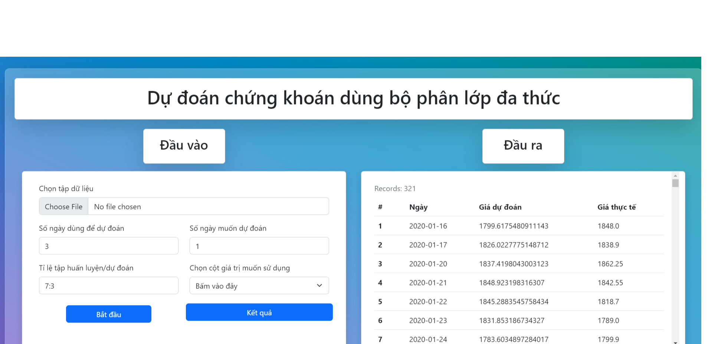
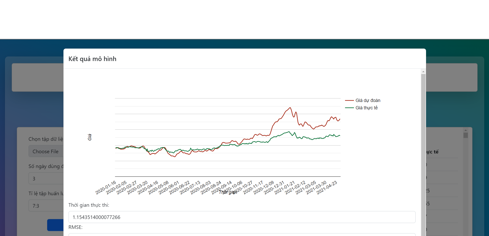

# Website predict stock use Polynomial Classifier
## User interface

### At the left of website: It uses to enter data and parameters for the model
- User can chose the dataset they want in button "Chose File"
- Then enter number of day use to be predicted in "Số ngày dùng để dự đoán"
- Enter number of day you want to predict in " Số ngày muốn dự đoán"
- Enter train/test in " Tỉ lệ tập huấn luyện, dự đoán"
- Chose the columns has stock price you want to predict in "Chọn cột  giá trị muốn sử dụng"
- Press "Bắt đầu" button to train model, then press "Kết quả" button to show result and line chart
### At the right of website: It shows predict price, real price of each day
### The chart show predict price and real price

